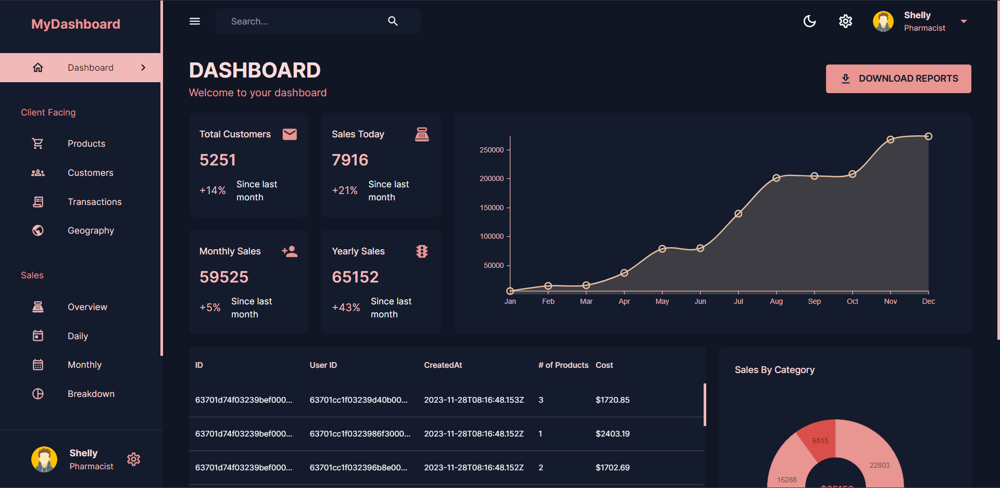

# MERN Dashboard Project



This comprehensive dashboard project is built using the MERN (MongoDB, Express.js, React, Node.js) stack, providing a versatile interface for managing various aspects of data visualization, client interaction, and administrative functionalities. It offers light and dark mode themes for optimal user experience and is designed to be responsive across different devices.

## Table of Contents

1. [Demo](#Demo)
2. [Introduction](#introduction)
3. [Features](#features)
4. [Technologies Used](#technologies-used)
5. [Packages Used](#packages-used)
6. [Installation](#installation)
7. [Folder Structure](#folder-structure)
8. [Running the Application](#running-the-application)
9. [Author](#author)
10. [Documentation](#documentation)

## Demo

You can see a live demo of the portfolio website at https://react-dashboard12.vercel.app.

## Introduction

This project aims to offer a comprehensive dashboard solution utilizing the MERN stack. It provides a user-friendly interface with multiple tabs for handling various aspects of data visualization, product management, customer interaction, geographical insights, and sales analytics. The frontend is developed with React, integrating Nivo for graph components and MUI for visual components and MUI-X for tables. Meanwhile, the backend utilizes Express.js and MongoDB via Mongoose for data handling.

## Features

### Client Tabs

- **Dashboard**: Offers an overview of essential metrics and insights.
- **Products**: Enables management and tracking of product-related information.
- **Customers**: Handles customer data, interactions, and preferences.
- **Transactions**: Tracks and visualizes transaction details.
- **Geography**: Provides geographical data visualization for insights.

### Sales Tabs

- **Overview**: Presents a general overview of sales performance.
- **Daily**: Displays daily sales data for quick analysis.
- **Monthly**: Visualizes monthly sales trends and patterns.
- **Breakdown**: Provides a detailed breakdown of sales data.

### Management Tabs

- **Admins**: Allows management of administrative tasks.
- **Performance**: Monitors and evaluates system performance metrics.

### Visual Customization

- **Light and Dark Mode**: The dashboard offers users the flexibility to switch between light and dark mode, ensuring optimal viewing comfort under different preferences and lighting conditions.

### Responsiveness

- **Responsive Design**: The dashboard is designed to be responsive, adapting seamlessly to various screen sizes and devices. Whether accessed from desktops, tablets, or mobile devices, users can expect a consistent and user-friendly experience across different platforms.

## Technologies Used

### Frontend

- **React**: JavaScript library for building user interfaces.
- **Nivo**: Data visualization library for React.
- **Material-UI (MUI/MUI-X)**: React UI components for modern web applications.
- **React Router DOM**: For client-side routing within the application.

### Backend

- **Node.js**: JavaScript runtime environment for server-side development.
- **Express.js**: Web application framework for Node.js.
- **MongoDB**: NoSQL database for data storage.
- **Mongoose**: Object Data Modeling (ODM) library for MongoDB and Node.js.

### Other Technologies

- **HTML/CSS**: Frontend markup and styling.
- **JavaScript (ES6+)**: Programming language used in both frontend and backend.

## Packages Used

### Client-side

- **@emotion/react**: Library for CSS-in-JS styling.
- **@mui/icons-material**: Material-UI icons for the application.
- **@mui/material**: Material-UI components for UI design.
- **@mui/x-data-grid**: Data grid component for Material-UI.
- **@nivo/bar**, **@nivo/core**, **@nivo/geo**, **@nivo/line**, **@nivo/pie**: Nivo chart components.
- **react-datepicker**: Datepicker component for React.
- **react-redux**: Official React bindings for Redux state management.
- **react-router-dom**: Declarative routing for React applications.

### Server-side

- **body-parser**: Middleware for parsing incoming request bodies.
- **cors**: Middleware for enabling cross-origin resource sharing.
- **dotenv**: Module for loading environment variables from a .env file into process.env.
- **express**: Web application framework for Node.js.
- **helmet**: Middleware for securing HTTP headers.
- **mongoose**: ODM library for MongoDB and Node.js.
- **morgan**: HTTP request logger middleware for Node.js.
- **nodemon**: Utility for automatically restarting the Node.js server upon file changes.

### Installation

#### Environment Variables Setup

The project relies on environment variables for configuration. Follow the instructions below to set up the necessary environment variables:

#### Client-side Environment Variables

Create a `.env` file in the `client` directory and add the following variable:

```bash
VITE_APP_BASE_URL="http://localhost:5001"
```

This variable defines the base URL for API requests in the client-side code.

#### Server-side Environment Variables

Create a `.env` file in the `server` directory and add the following variables:

```bash
MONGO_URL="YOUR_MONGODB_URL"
PORT=5001
```

Ensure to replace `YOUR_MONGODB_URL` with your actual MongoDB URL. The `PORT` variable specifies the port number for the server.

**Note**: Environment variables containing sensitive information like API keys, database credentials, or any other secrets should not be committed to version control. Ensure that the `.env` files are included in your project's `.gitignore` file to prevent accidental exposure of sensitive data.

### Getting started

1. Clone this repository to your local machine:

```bash
git clone https://github.com/Shivam-Sharma-1/Dashboard.git
```

2. Change to the project directory:

```bash
cd dashboard
```

3. Install and run client dependencies:

```bash
cd client
npm install
npm run dev
```

4. Install and run server dependencies:

```bash
cd server
npm install
npm run dev
```

Open your web browser and visit http://localhost:5173 to see the website in action during development.

## Folder Structure

The project structure is organized as follows:

```
MERN-Dashboard/
│
├── client/               # Client-side codebase (React)
│   ├── public/
│   ├── src/
|   |   ├── assets/       # Static assets
│   │   ├── components/   # React components
│   │   ├── scenes/       # Different pages for the dashboard
│   │   ├── state/        # API service functions
│   │   ├── main.jsx      # Main application component
|   ├── .env              # Environment variables (not committed to version control)
|   ├── package.json      # Client-side dependencies and scripts
│   │   └── ...
│   └── ...
│
├── server/               # Server-side codebase (Node.js, Express)
│   ├── controllers/      # Route controllers
│   ├── models/           # Database models (Mongoose)
│   ├── routes/           # API routes
│   ├── data/             # Raw data used to populate the database
│   ├── app.js            # Express app configuration
|   ├── .env              # Environment variables (not committed to version control)
|   ├── package.json      # Server-side dependencies and scripts
scripts
│   │   └── ...
│   └── ...

```

This structure separates the client and server codebases for better organization and modularity.

## Running the Application

- Start the server: `npm run dev` in the `server` directory.
- Start the client: `npm run dev` within the `client` directory.

## Author

- [@Shivam-Sharma-1](https://github.com/Shivam-Sharma-1)

Certainly! Here's the documentation section with relevant links:

## Documentation

- **[React Documentation](https://reactjs.org/docs/getting-started.html)**: Explore React documentation for building user interfaces.
- **[Nivo Documentation](https://nivo.rocks/docs/)**: Discover Nivo documentation for data visualization components in React.
- **[Material-UI Documentation](https://mui.com/getting-started/usage/)**: Dive into Material-UI documentation for React UI components.
- **[Express.js Documentation](https://expressjs.com/en/starter/installing.html)**: Learn more about Express.js for building web applications with Node.js.
- **[MongoDB Documentation](https://docs.mongodb.com/)**: Explore MongoDB documentation for NoSQL database management.
- **[Mongoose Documentation](https://mongoosejs.com/docs/)**: Refer to Mongoose documentation for MongoDB object modeling in Node.js.
- **[React Router DOM Documentation](https://reactrouter.com/web/guides/quick-start)**: Learn how to use React Router DOM for client-side routing within the application.

---

Feel free to adjust any sections or details according to your preferences!
